<!-- ANIMATED HEADER -->

 

<!-- SOCIAL BADGES -->

 

## `> whoami`

**3D artist & motion designer** who builds worlds, breaks renders, and pushes polygons. I bring ideas to life through modeling, animation, and real-time visuals — always exploring the intersection of art and code.

 

<!-- TWO-COLUMN LAYOUT -->
<table>
<tr>
<td width="50%" valign="top">

### ⚡ What I Work With

**3D & Motion**
`Blender` `Cinema 4D` `Houdini` `After Effects`
`Unreal Engine` `Unity`

**Design**
`Photoshop` `Illustrator` `Figma` `Substance Painter`

**Code**
`Python` `JavaScript` `GLSL` `HTML/CSS`

</td>
<td width="50%" valign="top">

### 🔥 What I'm Up To

- Building immersive 3D experiences
- Experimenting with real-time rendering & shaders
- Bridging the gap between art and development
- Always learning, always creating

</td>
</tr>
</table>

 

<!-- STATS -->

 

<!-- STREAK -->

---

**Let's create something wild.**

